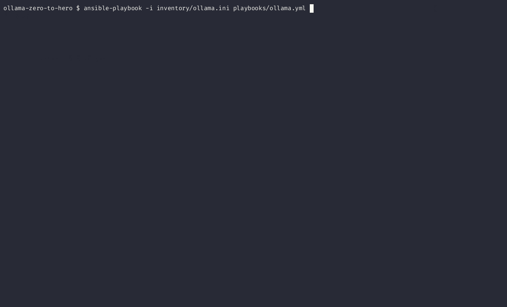

🚀 Ubuntu 24.04 Setup with Ollama, llama3.1, and NVIDIA Tools 🚀

This Ansible playbook sets up a fresh Ubuntu 24.04 installation with essential tools for running Ollama, llama3 using a NVIDIA GPU for acceleration.



## Playbook Features

- Pre-flight checks
  - Ensures enough disk space (at least 30GB)
    - This installation takes up ~22GB of space
- Updates and upgrades apt packages
- Installs
  - NVIDIA driver
  - CUDA toolkit
  - Docker
  - Ollama
- Pulls llama3.1 model
- Pulls Open WebUI docker image
- Creates systemd services for Open WebUI and Ollama
- Exposes Open WebUI on port `:8080`

## Prerequisites

- [ ] You have remote access (e.g., ssh) to the system you want to configure.
- [ ] You have `sudo` access on the system you want to configure.
- [ ] `ansible-playbook` is installed on the system you're running the playbook from.
- [ ] A fresh Ubuntu 24.04 installation.
- [ ] A VM/computer with an NVIDIA GPU.

## How to use

### 1. Download this repo

- Click [this](https://github.com/zchryr/ollama-zero-to-hero/archive/refs/heads/main.zip) link to download a `.zip` of this repo; or
- Use Git `git clone https://github.com/zchryr/ollama-zero-to-hero.git`

### 2. Install `ansible-playbook`

Review the [ansible docs](https://docs.ansible.com/ansible/latest/installation_guide/installation_distros.html) for the installation method which best suits your system.

### 3. Update the `./inventory/ollama.ini` file

This file should include the host that you want to install ollama on. Please review the [ansible connection details](https://docs.ansible.com/ansible/latest/inventory_guide/connection_details.html) documentation for various methods for authentication. In the example, ansible authenticates with [key based ssh authentication](https://www.digitalocean.com/community/tutorials/how-to-configure-ssh-key-based-authentication-on-a-linux-server).

**Example**

`ollama` = The name for the host.

`ansible_host=192.168.1.50` = The IP address of the host.

`ansible_user=user` = The user on the host that you will be authenticating as.

`ansible_ssh_private_key_file=your-private-ssh-key-here` = Your local private ssh key that will be used to authenticate to the host. An example of this could be `~/.ssh/id_rsa`. This will vary depending on your system & setup.

```ini
[ubuntu]
ollama ansible_host=192.168.1.50 ansible_user=user ansible_ssh_private_key_file=your-private-ssh-key-here
```

### 4. Execute the playbook

Execute `ansible-playbook -i ./inventory/ollama.ini ./playbooks/ollama.yml` in the unzipped/cloned repo to run the playbook.

### 5. Use Llama3 via Open WebUI

1. Go to the IP address of the VM/computer. For example `http://192.168.1.50:8080`
2. Register your first user. This will become your admin user.
3. Open a new chat and select llama3.1 as the model.
4. Have fun!

**Troubleshooting:**

If you encounter any issues during the deployment process, please refer to the Ansible logs and output files for more information.

You can increase verbosity by adding `-v`, `-vv`, or `-vvv` to the end of your `ansible-playbook` command.

🦙 Happy local-LLMing!
